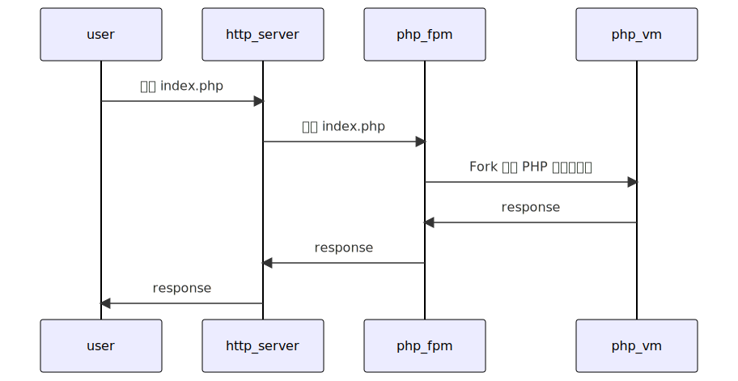
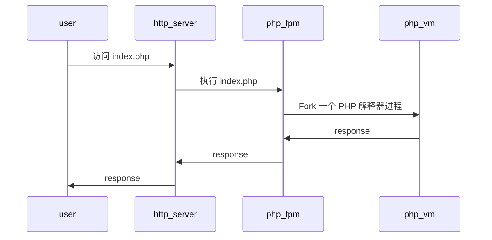

# MPGA

Make php great again. 🤥

很多年之前学习一次 PHP。当时还没有 PHP 的梗。PHP 容易上手以及 c 风格的语法让我难忘。

那个年代学校图书馆也没有正经的编程语言方面的书籍；那个年代 js 也只能在浏览器上运行，也就做些动画效果；那个年代，写网页还是 Dreamware，Frontpage 之流；那个年代 MS 还在推广基于 VBScript 的 ASP。那时的 PHP 是真的领先一个时代——性能好，开发方便，LAMP 组合拳打 java，脚踢 dotnet。

不过很快，PHP 的优势被拉平。硬件性能越来越好，开发人员水平也逐年上升。ROR 面世，Spring Boot 跟进，Nodejs 出现，GO 出世，再到现在 Rust 也进入 Web 开发领域。PHP 的竞品越发强大。当然 PHP 也不是一成不变。

如今 PHP8.2 也快发布，JIT、Train、Type hinting、Fiber 都加上了。PHP 的劲性能也越发强大。

但是，有一点 PHP 至今没有改变——PHP 这么多年，一直是 one shot 程序。

人们常说 PHP 性能不怎么样。我认为其实更多是 PHP 系统的综合性能不好。单单比较 PHP 虚拟机的性能。Zend VM 的性能真不算差，[比 Python、Ruby 好太多](TCLBG)。但是 PHP 系统综合性能一般，特别并发性能不好。这点大概就是 PHP 的编程模型的锅—— PHP 程序通常是 one shot 程序，依赖操作系统的进程管理。

[TCLBG]: https://benchmarksgame-team.pages.debian.net/benchmarksgame/fastest/php-python3.html

PHP 的一个典型使用场景就是 Web 网站。一个网站一般由 http server、php-fpm、database 三个程序组成。大致的执行流程：

1. 用户打开网站，首先连接到 http server；
2. http server 发现的是访问一个 .php 文件；
3. http server 通过 fast-cgi 调用 php-fpm；
4. php-fpm 会 fork 一个 php 解释器进程来执行该 .php 文件，并将结果通过 fast-cgi 接口返回到 http server；
5. http server 再将结果回传到用户浏览器，最终由浏览器呈现结果。

php-fpm 是一个进程管理器，一是负责创建和管理 php 解释器进程，二是提供 opcache、jit 之类的优化。由此可以看出每次访问 php 页面，都会启动一个新 vm 来解释执行，虽然中间会有一些优化的措施，但本质还是一个 one shot 程序。如同 command line 程序，由 shell 负责启动命令，然后执行、最后销毁。执行的时间甚至不需要 gc。

进程创建是一个相当消耗性能的过程，PHP 的这种执行模式虽然简化了编程模型，用户到编程的时候完成不需要考虑 gc 的性能，one shot 程序结束时甚至还没有达到 gc 的压力点。但是这种架构也是带来了明显的性能缺陷，每次 fork 进程会带来大量的消耗，操作系统也不可能创建无数个进程。好在解决方法也比较简单粗暴，「加机器」就可以了。

这个架构还有另一个问题，用户并发的压力最终会传递到数据库。众所周知，数据库也是一个并发困难的系统。这通常需要增加一个数据库代理来缓解压力。问题是贵司的业务是否已经触及了 PHP 系统的压力。

也有人说 PHP 增加这么多特性，不如直接 Java。然后网上又出现了这样的言论：[感觉要把 PHP 改 Java 的公司都容易倒闭，为啥？](https://www.zhihu.com/question/396777378)确实讽刺。我认为**一个业务系统，最重要的任务是支撑业务的运行，而不是工程上的优雅**。PHP 就是是 quick and dirty，快速实现业务系统是 PHP 的核心优势。

现在的 PHP 开发在追求 ROR 那般复杂的框架，又是 IOC，又是 ORM，基本上放弃了 PHP 的短平快。遗留系统用不上，新系统不如直接上 Java 或 Go。于是 PHP 框架性能整体处于[测试的低位](https://web-frameworks-benchmark.netlify.app/result?f=gin,echo,axum,salvo,laravel,django,spring)。

workerman、swoole 多少也给 PHP 带来了一点变化。只是 workerman、swoole 已经不再是传统的 PHP。架构的变化给 PHP 带来了性能上的明显提升，可是现在的国内的这种 PHP 环境，还有多少公司愿意在新业务上使用 PHP 开发呢？

PHP 还会继续在流行榜上，但是在国内，PHP 已经差不多了。作为平替，可能是 JS，也可能是 WASM。

Make php great again？真的难。

----

- 2022-11-13
