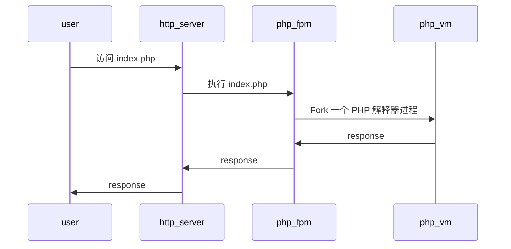

# Make php great again?

>先说下背景。我早期学习过 PHP，那时大概是 5.0，现在因为工作的需要，又体现了一下最新 PHP8，于是就有了这篇文章。全部为个人意见，如有不同，请以你为准。

很多年之前学习一次 PHP。当时还没有流行 PHP 梗。PHP 容易上手、快速开发、C 风格的语法让我难忘。

那个年代学校图书馆也没有正经的编程语言方面的书籍；那个年代 JavaScript 也只能在浏览器上运行，做些动画效果；那个年代，写网页还是 Dreamware，Frontpage 之流；那个年代 MS 还在推广基于 VBScript 的 ASP。那时的 PHP 是真的领先一个时代——性能好，开发方便，LAMP 组合拳打 Java，脚踢 C++。

不过很快，PHP 的优势被拉平。硬件性能越来越好，开发人员水平也逐年上升。ROR 面世，Spring Boot 跟进，Nodejs 出现，Go 出世，再到现在 Rust 也进入 Web 开发领域。PHP 的竞品越发强大。PHP 也变得越来越冷门。

PHP 也不是一成不变。如今 PHP8.2 也快发布，JIT、Train、Type hinting、Fiber 都加上了。PHP 的劲性能也越发强大。只是有一点 PHP 至今没有改变——PHP 这么多年，一直是 one shot 程序。

常说 PHP 性能不怎么样，更多是指 PHP 系统的综合性能不好，QPS 结果难看。单单比较 PHP 虚拟机的性能，Zend VM 的性能并不差，[比 Python、Ruby 好太多][TCLBG]。但是 PHP 系统综合性能一般，特别并发性能不好。这点大概就是 PHP 的编程模型的锅—— PHP 程序通常是 one shot 程序，重度依赖操作系统的进程管理。

[TCLBG]: https://benchmarksgame-team.pages.debian.net/benchmarksgame/fastest/php-python3.html

PHP 的一个典型使用场景就是 Web 网站。一个 PHP 网站至少包含三层：http server、php-fpm、database。大致的执行流程：

1. 用户打开网站，首先连接到 http server；
2. http server 发现的是访问一个 .php 文件；
3. http server 通过 fast-cgi 调用 php-fpm；
4. php-fpm 会 fork 一个 php 解释器进程来执行该 .php 文件，并将结果通过 fast-cgi 接口返回到 http server；
5. http server 再将结果回传到用户浏览器，最终由浏览器呈现结果。

php-fpm 是一个进程管理器，包含在 PHP 核心中。php-fpm 一是负责创建和管理 php vm 进程，二是提供 opcache、jit 之类的优化。每次访问 php 页面，都会启动一个新 vm 来解释执行，虽然中间会有一些优化的措施，但本质还是一个 one shot 程序。如同 command line 程序，由 shell 负责启动命令，然后执行、最后销毁。代码运行的生命周期内甚至不会触发 gc。

进程创建是一个相当消耗性能的过程，PHP 的这种执行模式虽然简化编程模型，用户编程的时候完成不需要考虑 gc 的性能。但这种架构也是带来了明显的性能缺陷，每次 fork 进程会带来大量的消耗，操作系统也不可能创建无数个进程来处理用户的请求。好在解决方法也比较简单粗暴，「加机器」就可以了。

这种架构还有另一个问题，用户并发的压力最终会传递到数据库。数据库也是一个并发困难的系统。这通常需要增加一个数据库代理层来缓解压力。

有人说 PHP 增加这么多特性，不如直接 Java。然后网上又出现了这样的言论：[感觉要把 PHP 改 Java 的公司都容易倒闭，为啥？](https://www.zhihu.com/question/396777378)确实讽刺。不过可能是事实，小体量的公司，业务上可能一直达不到的 PHP 的上限。**一个业务系统，最重要的任务是支撑业务的运行，而不是工程上的优雅**。PHP 就是 quick and dirty，快速实现业务系统就是 PHP 的核心优势。

现在的 PHP 项目都在追求 ROR 那般复杂的框架，大量运用 OOP 的实践，又是 IOC，又是 ORM，基本上放弃了传统 PHP 的短平快。PHP 框架性能整体处于[性能测试的垫底](https://web-frameworks-benchmark.netlify.app/result?f=gin,echo,axum,salvo,laravel,django,spring)。对于这些框架，遗留系统用不上，新系统一看性能表现不如直接上 Java 或 Go。现在 PHP 生态中也出现像 workerman、swoole、roadrunner 这种新型的框架。这些框架有着强大的性能，多少也给 PHP 带来了一点变化。

只是 workerman、swoole 已经不再是传统的 PHP（可以常驻内存运行了）。PHP 语言本身也因为早期一些不合理的设计，一致性相当差，在写融资 PPT 时也不能成为亮点。在国内的现在 Java、Go 盛行，大厂高程到处输出的环境下，还有多少公司愿意在新业务上使用 PHP 开发呢？

我相信 PHP 还会继续在流行榜上一段很长的时候，然后慢慢变成冷门语言。在国内，PHP 可谓气数已尽，像极了当年的网红 Ruby。作为平替，Java、Go、~~Rust~~ 会是适合的选择。Nodejs 当然也是一个选择，另外就是 WASM。Serverless 的开发模式也在挑战 PHP 的根本。

Make php great again？至少在国内是真的难。

----

- 2022-11-13
