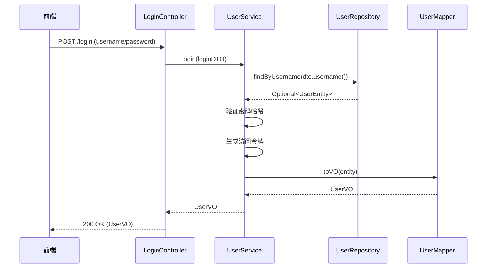

### Java 分层架构概念解析（以登录为例）

#### 1. 核心概念说明

| 类型   | 职责                                    | 示例内容                           |
| ------ | --------------------------------------- | ---------------------------------- |
| Entity | 与数据库表结构一一对应                  | User (id,username,hashed_password) |
| DAO    | 数据库操作接口                          | UserDao.findByUsername()           |
| DTO    | 服务层与控制器层之间的数据传输对象      | LoginDTO(username,rawPassword)     |
| VO     | 返回给前端的展示数据（可能脱敏/格式化） | LoginVO(username,email,token)      |

#### 2. 时序图



#### 3. 代码实现（基于 Spring Boot 3.2+）

##### 项目结构

```text
src/
├── main/
│   ├── java/
│   │   └── com/example/
│   │       ├── controller/
│   │       ├── dto/
│   │       ├── entity/
│   │       ├── repository/
│   │       ├── service/
│   │       ├── vo/
│   │       └── mapper/
```

##### 具体代码文件

1. **Entity（持久化层）**

```java
@Data
@Entity
@Table(name = "users")
public class UserEntity {
    @Id
    @GeneratedValue(strategy = GenerationType.IDENTITY)
    private Long id;

    @Column(unique = true, nullable = false)
    private String username;

    @Column(nullable = false)
    private String hashedPassword;

    private String email;
    // 其他字段...
}
```

2. **DAO（数据访问层）**

```java
public interface UserRepository
    extends JpaRepository<UserEntity, Long> {

    Optional<UserEntity> findByUsername(String username);
}
```

3. **DTO（数据传输对象）**

```java
public record LoginDTO(
    @NotBlank String username,
    @NotBlank @Size(min=8) String rawPassword
) {}
```

4. **VO（视图对象）**

```java
public record LoginVO(
    String username,
    String email,
    String accessToken
) {}
```

5. **Mapper（转换层）**

```java
@Mapper(componentModel = "spring")
public interface UserMapper {

    @Mapping(target = "accessToken", ignore = true)
    LoginVO toVO(UserEntity entity);

    default LoginVO toVOWithToken(UserEntity entity, String token) {
        LoginVO vo = toVO(entity);
        return new LoginVO(
            vo.username(),
            vo.email(),
            token
        );
    }
}
```

6. **Service（业务逻辑层）**

```java
@Service
@RequiredArgsConstructor
public class AuthService {
    private final UserRepository userRepository;
    private final PasswordEncoder passwordEncoder;
    private final UserMapper userMapper;
    private final JwtTokenGenerator tokenGenerator;

    public LoginVO login(LoginDTO dto) {
        UserEntity user = userRepository.findByUsername(dto.username())
            .orElseThrow(() -> new UserNotFoundException(dto.username()));

        if (!passwordEncoder.matches(dto.rawPassword(), user.getHashedPassword())) {
            throw new InvalidPasswordException();
        }

        String token = tokenGenerator.generateToken(user.getUsername());
        return userMapper.toVOWithToken(user, token);
    }
}
```

7. **Controller（控制层）**

```java
@RestController
@RequestMapping("/api/auth")
@RequiredArgsConstructor
public class AuthController {
    private final AuthService authService;

    @PostMapping("/login")
    public ResponseEntity<LoginVO> login(@Valid @RequestBody LoginDTO dto) {
        return ResponseEntity.ok(authService.login(dto));
    }
}
```

#### 4. 关键实现说明

1. **密码安全处理**：
   • 使用 BCryptPasswordEncoder 进行密码哈希验证
   • 原始密码不会存储和传输到服务层之外

2. **DTO 验证**：
   • 使用 Jakarta Validation 注解进行输入校验
   • 自动触发 MethodArgumentNotValidException

3. **映射策略**：
   • MapStruct 在编译时生成映射实现类
   • 使用`toVOWithToken`实现带令牌的 VO 转换

4. **JWT 集成**：
   • TokenGenerator 可自行实现或使用 Spring Security 的 JWT 库

#### 5. 推荐扩展方向

1. 在 Entity 与 DTO 之间增加一层领域对象（Domain Model）
2. 添加 DTO 到 Entity 的逆向映射
3. 使用 Spring Security 进行更完整的认证授权管理
4. 在 VO 中添加 Swagger 注解完善 API 文档
5. 实现 DTO 分组校验（如创建/更新使用不同校验规则）

---

- 2025-04-16 by DeepSeek R1
